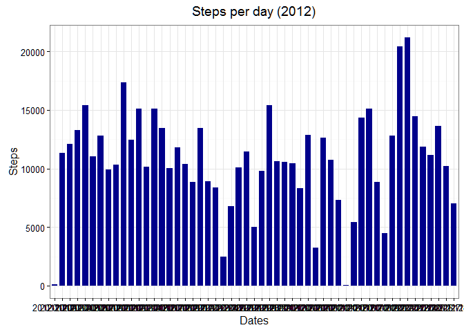
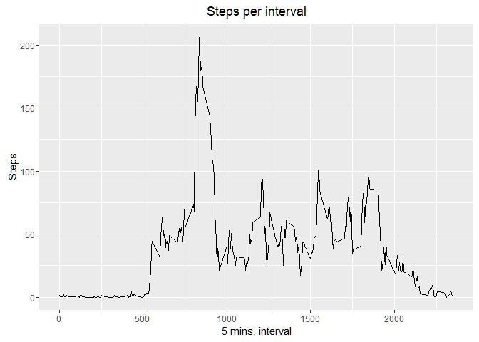
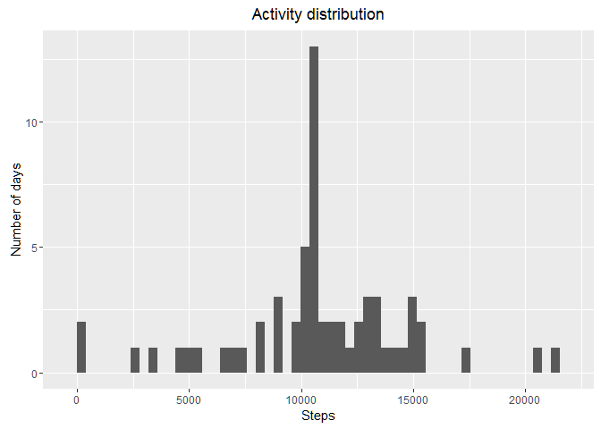
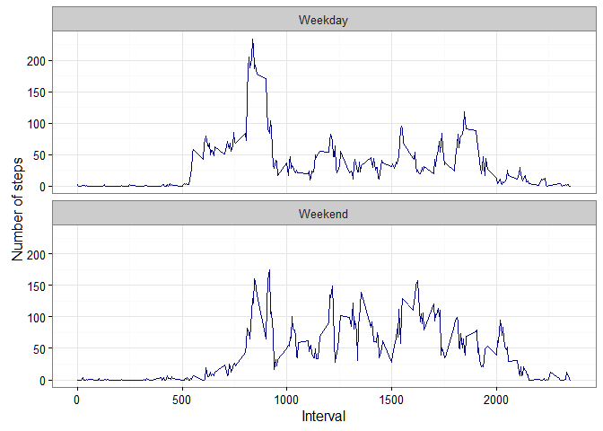

This project is based on a dataset containing activity monitoring
information automatically gathered using devices - Fitbit like.

The dataset contains the following fields

-   Steps: Number of steps in the interval, missing values coded as NA
-   Date: factor with the date of the measure, YYYY-MM-DD format.
-   Interval: Five minutes interval represented as (0, 5, ..., 155, 200,
    ... ,2355), where 0 represents the interval from 00:00 to 00:05
    hours, 135 the interval from 01:35 to 01:40 and 2355 is the last
    interval representing from 23:55 to 00:00 the next day.

Loading and Preprocesing data
-----------------------------

Data is loaded using

    myData <- read.csv("activity.csv")

Results agregated per day
-------------------------

Data is aggregated by each day of measure.

    mySumData <- aggregate( steps ~ date, data = myData, FUN = sum)

We have created a new dataframe with only one record per day, this is,
the **total steps for each day**. Now we display graphically the results
using an histogram

    library(ggplot2)
    ggplot(mySumData, aes(steps)) +
         geom_histogram(bins = 53) +
         labs(x="Steps", y="Number of days") + 
         labs(title=expression("Activity distribution"))

<!-- -->

This histogram represents the distribution of steps taken. So there are
few days with no activity and most of the days about 10.000 steps are
registered.

If we want to see now many steps have been taken each day, we propose
the following bar chart (Not requested by the exercise)

    library(ggplot2)
    ggplot(mySumData, aes(factor(date), steps)) +
      geom_bar(stat="identity",fill="darkblue",width=0.75) +
      theme_bw() +  guides(fill=FALSE) +
      labs(x="Dates", y="Steps") + 
      labs(title=expression("Steps per day (2012)"))

<!-- -->

To provide additional information, we calculate the mean and median per
day

Mean:

    mean(mySumData$steps)

    ## [1] 10766.19

Median:

    median(mySumData$steps)

    ## [1] 10765

Research on daily patterns
--------------------------

To further investigate we split the data into a dataframe that contains
the average of steps that are taken at each by interval. This way we can
compare if more steps are taken in the morning, afternoon, etc.

    myAvgData <- aggregate(steps ~ interval, data = myData, FUN = mean)

Not surprisingly, this data feame has 288 observations as 288 is the
number of 5 minutes periods in 1 day. We represent graphically this
information

    ggplot(myAvgData, aes(interval, steps)) +
         geom_line() +
         labs(x="5 mins. interval", y="Steps") + 
         labs(title=expression("Steps per interval"))

<!-- -->

We can also identify the period where more steps are taken

    maxInterval <- myAvgData[max(myAvgData$steps) == myAvgData$steps,]
    maxInterval$interval

    ## [1] 835

This result should correspond with the information shown on the time
series plot above. In our example, this correspond to 8:35 in the
morning, a typical commute time.

Imputing missing values
-----------------------

In our original data there are a number of days/intervals where there
are missing values (coded as NA). If coding of missing values is
different we may need a pre-processing.

The total number of rows with missing values is:

    nrow(myData[is.na(myData$steps),])

    ## [1] 2304

We will replace those missing values with the mean of the value for that
interval.

For that purpose, we write a function that accepts as parameters the
data frame to be cleaned and the dataframe that contains the average
values for each period

    CleanNA <- function(df, avgDf) {
      for(i in 1:nrow(df)) {
        if (is.na(df[i,]$steps)) {
          j <- df[i,]$interval
          df[i,]$steps <- avgDf[avgDf$interval == j,]$steps
        }
      }
      df
    }

Using this function we create the new dataframe with no "NA" values.

    cleanData <- CleanNA(myData, myAvgData)

Now, in order to compare with the initial data, we reproduce the
histogram and the calculations

    myCleanSumData <- aggregate( steps ~ date, data = cleanData, FUN = sum)
    library(ggplot2)
    ggplot(myCleanSumData, aes(steps)) +
         geom_histogram(bins = 53) +
         labs(x="Steps", y="Number of days") + 
         labs(title=expression("Activity distribution"))

<!-- -->

Mean:

    mean(myCleanSumData$steps)

    ## [1] 10766.19

Median:

    median(myCleanSumData$steps)

    ## [1] 10766.19

Activity patterns in weekdays vs weekends
-----------------------------------------

Finally, for this study We will compare activity in in weekdays vs
weekends. For that we will create a new factor variable in the dataset

For that purpose, we first find out the day of the week for each date:

    wdnames <- weekdays(as.Date(myData$date))

But days' names are not very useful. In particular, they are language
dependent (as in our example that they are in Spanish - Note, we have
not changes the language settings intentionally to show this potential
problem). Therefore, we create an array stating with TRUE or FALSE if
the day is weekend or not.

    weTorF = sapply(wdnames, function (x) {x == "sábado" || x == "domingo"} )

Note: For other languages, substitute "sábado" by "saturday", or its
equivalent, and "domingo" by "sunday"

Now we add this array as a new collumn to our data frame

    myData[,"isWeekend"] <- weTorF

We create two dataframes, one for each type of day

    myDataWeekDay <- myData[myData$isWeekend==FALSE, ] 
    myDataWeekEnd <- myData[myData$isWeekend==TRUE, ]

And we compute again the average per period of the day

    myAvgDataWd <- aggregate(steps ~ interval, data = myDataWeekDay, FUN = mean)
    myAvgDataWe <- aggregate(steps ~ interval, data = myDataWeekEnd, FUN = mean)

The next step is to create a single data frame from these, but with an
additional variable that indicates the type of day

    myAvgDataWd[, "type"] <- "Weekday"
    myAvgDataWe[, "type"] <- "Weekend"
    myAvgDataDays <- rbind(myAvgDataWd, myAvgDataWe)

    ggplot(myAvgDataDays, aes(x=interval, y=steps)) + 
           geom_line(color = "darkblue") + 
           facet_wrap(~ type, nrow=2, ncol=1) +
           labs(x="Interval", y="Number of steps") +
           theme_bw()

<!-- -->

In our study, activity during weekends starts later and it is more
homogenous. During weekdays is particularly high at commute slot of the
day.
